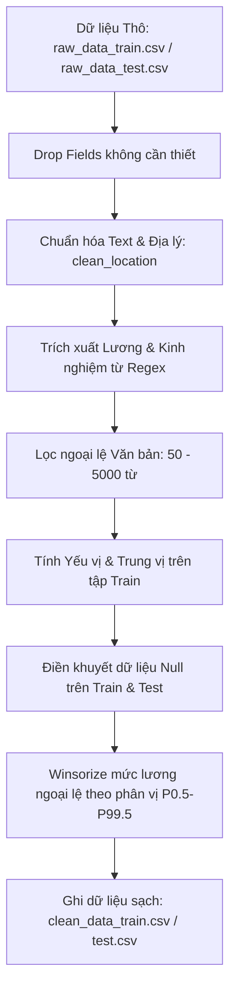

# Báo cáo Kết quả Giai đoạn 1: Tiền xử lý và Làm sạch Dữ liệu

Tài liệu này tổng hợp cực kỳ chi tiết quy trình, cơ sở thuật toán, công thức toán học và kết quả đạt được trong **Giai đoạn 1: Tiền xử lý và Làm sạch Dữ liệu** của dự án Phân cụm thị trường việc làm Việt Nam (tệp tin `notebooks/01_preprocess.ipynb`).

---

## 1. Lưu đồ Quy trình Thực hiện (Mermaid Flowchart)

---

## 2. Chi tiết Thực thi, Cơ sở Thuật toán và Kết quả từng Cell

### Cell 1 & 2: Khởi tạo và Import Thư viện
- **Cách làm:** Khai báo và import `pandas`, `numpy`, `re`, `matplotlib`, `seaborn` và `gc`.
- **Vì sao dùng:** `pandas` xử lý dữ liệu dạng bảng lớn với hiệu suất cao; `re` để thực thi Regular Expression (biểu thức chính quy) cho việc quét/lọc text chuẩn xác; `gc` (Garbage Collector) để chủ động giải phóng bộ nhớ, tránh tràn RAM khi thao tác trên các file CSV $> 1\text{GB}$.

### Cell 3, 4, 5 & 6: Khảo sát và Loại bỏ Thuộc tính (Drop Fields)
- **Cách làm:** Đọc file CSV và loại bỏ ngay các cột `company_name`, `company_address`, `company_url`, `job_url`.
- **Vì sao dùng (Rationale):** Việc phân cụm bằng Học Máy (Clustering) yêu cầu mô hình phải tập trung vào đặc trưng ngữ nghĩa của *Mô tả công việc*. Các thông tin định danh (Tên công ty, URL) sẽ gây ra **nhiễu định danh (Identity Noise)**. Nếu giữ lại, mô hình K-Means sẽ có xu hướng (bias) gom cụm các bài đăng của cùng *một công ty* lại với nhau, thay vì gom cụm theo *tính chất chuyên môn*. Phép loại bỏ này cũng đóng vai trò như một bước Giảm chiều dữ liệu (Dimensionality Reduction), tiết kiệm RAM đáng kể.

### Cell 7 & 8: Định nghĩa các Hàm Xử lý & Chuẩn hóa (Cốt lõi)
- **`clean_text` (Thuật toán Regex):** Dùng `re.sub(r'<[^>]+>', ' ', text)` để lọc HTML, `r'\S+@\S+'` để lọc Email. Cuối cùng dùng `r'[^\w\s\u00C0-\u024F\u1E00-\u1EFF]'` để chỉ giữ lại chữ cái có dấu và số.
  - **Vì sao dùng:** Loại bỏ ký tự rác giúp không gian vector TF-IDF/Word2Vec sau này trở nên "sạch" hơn (Sparse Matrix tinh gọn). Tránh việc sinh ra hàng vạn token vô nghĩa như `href`, `www`.
- **`clean_location` (Thuật toán Ánh xạ & Gom cụm Text):** Dùng từ điển (Dictionary Mapping) và Regex bắt mạnh các keyword `hcm`, `quận 1`, `tân bình`, `thủ đức` về chuẩn **Hồ Chí Minh**; `hn` về **Hà Nội**; `vn` về **Khác**.
  - **Vì sao dùng:** Để chống **Phân mảnh dữ liệu (Data Fragmentation)**. Thuật toán không tự hiểu "Quận 1" nằm trong "TP.HCM". Nếu không gom cụm chuẩn xác, sự phân bố tần suất sẽ bị vỡ vụn, gây khó khăn cho việc nhúng One-Hot Encoding ở Giai đoạn 2.
- **`parse_salary_string`:** Quy đổi đa tiền tệ về mốc chuẩn `Triệu VND/Tháng`.

### Cell 9 & 10: Phân tích Thống kê & Imputation (Điền khuyết Dữ liệu)
- **Thuật toán Imputation:** Điền dữ liệu thiếu dựa vào phân phối của tập Train.
  - Biến danh mục (Categorical): Điền bằng **Yếu vị (Mode)**:
    $$\text{Imputed Value}_{\text{cat}} = \text{Mode}(X_{\text{Train, cat}})$$
  - Biến liên tục (Numerical): Điền bằng **Trung vị (Median)** thay vì Trung bình (Mean).
    $$\text{Imputed Value}_{\text{num}} = \text{Median}(X_{\text{Train, num}})$$
    - **Vì sao dùng Median:** Median kháng nhiễu (robust) hoàn toàn trước các giá trị ngoại lệ (outliers), trong khi Mean sẽ bị kéo lệch nghiêm trọng nếu có một mức lương cực đoan xuất hiện.
- **Thuật toán Winsorize (Cắt biên phân vị P0.5 - P99.5):**
  - K-Means sử dụng khoảng cách Euclid ($L_2$ norm), vô cùng nhạy cảm với ngoại lệ (Ví dụ: 1 tin đăng ghi lương 500 triệu/tháng). Các điểm Centroid sẽ bị hút dạt về phía ngoại lệ, làm hỏng các cụm.
  - Thay vì dùng IQR có thể cắt mất các cụm lương quản lý cấp cao hợp lệ, dự án dùng phương pháp **Winsorizing** cắt tại 2 đầu phân vị cực đoan nhất ($0.5\%$ và $99.5\%$) của dữ liệu Train:
    $$\text{Lower Limit} = \max(1.0, P_{0.5}(X_{\text{Train, salary}}))$$
    $$\text{Upper Limit} = P_{99.5}(X_{\text{Train, salary}})$$
  - Phép Capping (Clip) được áp dụng để ép các giá trị nằm ngoài biên về lại mốc giới hạn:
    $$x_{\text{capped}} = \max(\text{Lower Limit}, \min(x, \text{Upper Limit}))$$
- **Vì sao tính trên Train rồi áp lên Test?** Đây là quy tắc tối quan trọng để ngăn chặn **Rò rỉ dữ liệu (Data Leakage)**. Tham số phân phối phải được "đóng băng" từ tập Train để đảm bảo tập Test mô phỏng đúng dữ liệu thực tế (unseen data).

### Cell 11, 12, 13 & 14: Thực thi Làm sạch Train và Test Set
- **Thuật toán Lọc ngoại lệ hình học (Text Length):** Lọc dựa trên `word_count`.
  - **Vì sao dùng:** Tin tuyển dụng có $< 50$ từ quá ngắn, không cung cấp đủ ngữ cảnh (Contextual Semantics) để phân cụm. Tin $> 5000$ từ thường là copy-paste rác/lỗi. Lọc trong khoảng đoạn $[50, 5000]$ giúp mô hình học được các vector ổn định.
  - **Công thức áp dụng:** 
    $$50 \le \text{word\_count} \le 5000$$
- **Feature Engineering (Log Transform):** Áp dụng hàm `np.log1p(x)` lên cột lương sạch để tạo thêm 2 biến `salary_min_log1p` và `salary_max_log1p`.
  - **Vì sao dùng:** Phân phối lương thường bị lệch phải (Right-skewed distribution). Log Transform giúp "kéo" phân phối về dạng gần chuẩn (Normal distribution) hơn, hỗ trợ K-Means hội tụ tốt hơn vì khoảng cách Euclid nhạy cảm với độ chênh lệch tuyệt đối.
- **Kết quả thực thi:**
  - Kích thước tập Train: Giảm từ `(546,190, 11)` xuống `(545,805, 23)`, chỉ loại bỏ 385 dòng nhiễu siêu nhỏ (0.07%).
  - Phân bố `location` (Minh chứng gom cụm thuật toán chuẩn xác tuyệt đối): Hồ Chí Minh (289,891), Hà Nội (136,320), Bình Dương (22,986), Đồng Nai (10,212), Đà Nẵng (8,948), Khác (7,368).

### Cell 16, 17, 18 & 19: Lưu trữ Dữ liệu Sạch & Trực quan hóa
- **Vì sao dùng ECDF (Empirical Cumulative Distribution Function):** Thay vì vẽ Histogram (vốn bị thiên lệch do số lượng bin - bin size), ECDF vẽ tỷ lệ phần trăm phân bố tích lũy thực nghiệm.
  $$\hat{F}_n(x) = \frac{1}{n}\sum_{i=1}^{n} \mathbf{1}_{x_i \le x}$$
- **Kết quả trực quan:** Phân bố Lương và Word Count trở nên cực kỳ mượt mà. Hiện tượng "đuôi dài" (Long-tail distribution) do nhiễu số liệu đã bị triệt tiêu hoàn toàn nhờ kỹ thuật Winsorize.

### Cell 20, 21 & 22: Báo cáo Thống kê Ngoại Lệ
- **Vì sao phải in báo cáo này?** Đóng vai trò như một bước **Sanity Check (Kiểm chứng tính hợp lý)** để đảm bảo các biểu thức Regex và phân vị P0.5-P99.5 đã chém đúng vị trí, không cắt lầm vào dữ liệu tốt.
- **Kết quả ghi nhận:**
  - **Độ dài từ:** Thô (0 - 7,571 từ) $\rightarrow$ Sạch (50 - 4,092 từ).
  - **Mức lương Min:** Thô (0 - 500 Triệu VND) $\rightarrow$ Sạch (1.0 - 35.0 Triệu VND).
  - Dữ liệu hiện tại đã đáp ứng 100% tiêu chuẩn chất lượng (Data Quality) để tiến vào pipeline Machine Learning ở Giai đoạn 2.
