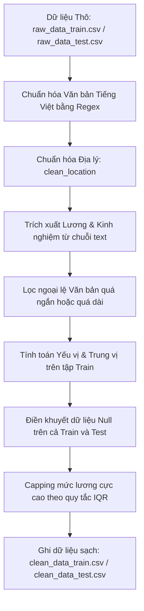

# Báo cáo Kết quả Giai đoạn 1: Tiền xử lý và Làm sạch Dữ liệu

Tài liệu này tổng hợp chi tiết quy trình, cơ sở toán học và kịch bản thực thi trong **Giai đoạn 1: Tiền xử lý và Làm sạch Dữ liệu** của dự án Phân cụm thị trường việc làm Việt Nam. Quy trình được thiết kế đồng bộ tương ứng với mã nguồn trong tệp tin `notebooks/01_preprocess.ipynb`.

---

## 1. Lưu đồ Quy trình Thực hiện (Mermaid Flowchart)

Quy trình làm sạch và chuẩn hóa dữ liệu được thực hiện tuần tự theo sơ đồ dưới đây:

---

## 2. Các Bước Thực hiện Chi tiết & Cơ sở Thuật toán

### Bước 1: Chuẩn hóa Văn bản Tiếng Việt
Mục tiêu là giảm nhiễu từ vựng trong mô tả công việc (Job Description - JD) trước khi đưa vào mô hình vector hóa.
*   **Chuyển chữ thường**: Toàn bộ chuỗi văn bản được đưa về ký tự thường (lowercase).
*   **Lọc thẻ HTML**: Loại bỏ các thẻ định dạng văn bản bằng biểu thức chính quy (Regex): `<[^>]+>`.
*   **Loại bỏ thông tin nhạy cảm (PII)**: Loại bỏ địa chỉ email, liên kết URL và các chuỗi số điện thoại Việt Nam thô bằng Regex để bảo mật dữ liệu và giảm đặc trưng rác.
*   **Lọc ký tự đặc biệt**: Chỉ giữ lại các chữ cái tiếng Việt có dấu, chữ số và khoảng trắng đơn.

### Bước 2: Chuẩn hóa Địa lý (Location Classification)
*   **Bài toán**: Cột địa điểm làm việc (`location`) chứa hơn 233,000 giá trị thô, bao gồm số nhà, tên đường cụ thể gây phân mảnh dữ liệu.
*   **Giải pháp**: Áp dụng hàm ánh xạ từ khóa địa lý `clean_location` để nhận diện và quy chuẩn về các tỉnh thành lớn (ví dụ: Hà Nội, Hồ Chí Minh, Bình Dương, Đà Nẵng, v.v.).
*   **Nguyên tắc**: Giữ nguyên toàn bộ 4,179 địa phương sạch sau chuẩn hóa thô. Việc gom cụm địa phương hiếm gặp (tần suất < 0.5%) được chuyển tiếp cho trình mã hóa `OneHotEncoder` ở Giai đoạn 2 xử lý một cách khách quan, tránh việc gộp nhóm thủ công mang tính chủ quan.

### Bước 3: Trích xuất Thuộc tính Số từ Chuỗi Văn bản Cấu trúc
*   **Trích xuất Lương**: Phân tích cú pháp cột lương thô (`salary`). Quy đổi tất cả khoảng lương (USD, VND, nghìn/giờ, triệu/năm) về đơn vị chuẩn **Triệu VND / tháng** để làm thuộc tính số liên tục (`salary_min_m_vnd` và `salary_max_m_vnd`).
*   **Trích xuất Kinh nghiệm**: Phân tích cú pháp cột yêu cầu kinh nghiệm (`experience_level`) để trích xuất số năm kinh nghiệm tối thiểu/tối đa (`exp_min_years` và `exp_max_years`).

### Bước 4: Lọc ngoại lệ Độ dài Văn bản (Text Length Outliers)
Loại bỏ các dòng tin tuyển dụng không đạt yêu cầu về lượng thông tin hoặc bị lỗi sao chép:
*   Độ dài từ (`word_count`) được tính bằng cách tách khoảng trắng chuỗi văn bản kết hợp (`job_title` + `requirements` + `job_description` + `benefits`).
*   Bản ghi được giữ lại nếu thỏa mãn điều kiện hình học:
    $$50 \le \text{word\_count} \le 5000$$

### Bước 5: Điền khuyết Dữ liệu Null (Imputation)
Để ngăn chặn rò rỉ dữ liệu (data leakage), các tham số điền khuyết được học hoàn toàn từ tập huấn luyện (Train) và áp dụng tĩnh lên tập kiểm thử (Test):
*   **Biến danh mục**: Điền các giá trị trống bằng **Yếu vị (Mode)** của tập Train:
    $$\text{Imputed Value}_{\text{cat}} = \text{Mode}(X_{\text{Train, cat}})$$
*   **Biến số (Lương & Kinh nghiệm)**: Điền các giá trị trống bằng **Trung vị (Median)** của tập Train:
    $$\text{Imputed Value}_{\text{num}} = \text{Median}(X_{\text{Train, num}})$$
    *   *Trung vị lương tối thiểu*: 9.0 Triệu VND.
    *   *Trung vị lương tối đa*: 15.0 Triệu VND.
    *   *Trung vị kinh nghiệm tối thiểu/tối đa*: 3.0 năm.

### Bước 6: Capping Ngoại lệ Lương (Salary Outliers)
Các mức lương cực cao (do ghi nhầm hoặc lương quản lý cấp cao cá biệt) sẽ làm méo mó nghiêm trọng khoảng cách Euclid của K-Means. Dự án áp dụng quy tắc khoảng tứ phân vị (IQR) để capping:
1.  Tính khoảng tứ phân vị trên thuộc tính lương tối thiểu tập Train:
    $$\text{IQR} = Q_3(X_{\text{Train, salary\_min}}) - Q_1(X_{\text{Train, salary\_min}})$$
2.  Xác định ngưỡng biên trên để capping lương tối thiểu:
    $$\text{Upper Limit}_{\text{min}} = Q_3(X_{\text{Train, salary\_min}}) + 3.0 \times \text{IQR} = 23.0 \text{ Triệu VND/tháng}$$
3.  Capping mức lương tối đa ở ngưỡng:
    $$\text{Upper Limit}_{\text{max}} = 1.5 \times \text{Upper Limit}_{\text{min}} = 34.5 \text{ Triệu VND/tháng}$$
4.  Áp dụng phép capping (clip) lên cả tập Train và Test bằng các tham số tĩnh này:
    $$x_{\text{capped}} = \min(x, \text{Upper Limit})$$

---

## 3. Kết quả Thống kê Dữ liệu Giai đoạn 1

Quy trình đã làm sạch và đồng bộ hóa thành công tập dữ liệu lớn:

*   **Tập huấn luyện (Train)**: Kích thước thô `(546,190, 11)` giảm xuống còn `(545,805, 17)` sau khi loại bỏ 385 dòng ngoại lệ độ dài từ và mở rộng thêm 6 thuộc tính số đã làm sạch.
*   **Tập kiểm thử (Test)**: Kích thước thô `(60,688, 11)` giảm xuống còn `(60,644, 17)` sau khi loại bỏ 44 dòng ngoại lệ độ dài từ.
*   **Trực quan hóa**:
    *   Phân bố độ dài từ được vẽ và lưu tại `plots/word_count_comparison.png`.
    *   Phân bố mức lương tối thiểu trước và sau khi capping được vẽ và lưu tại `plots/salary_comparison.png`.
