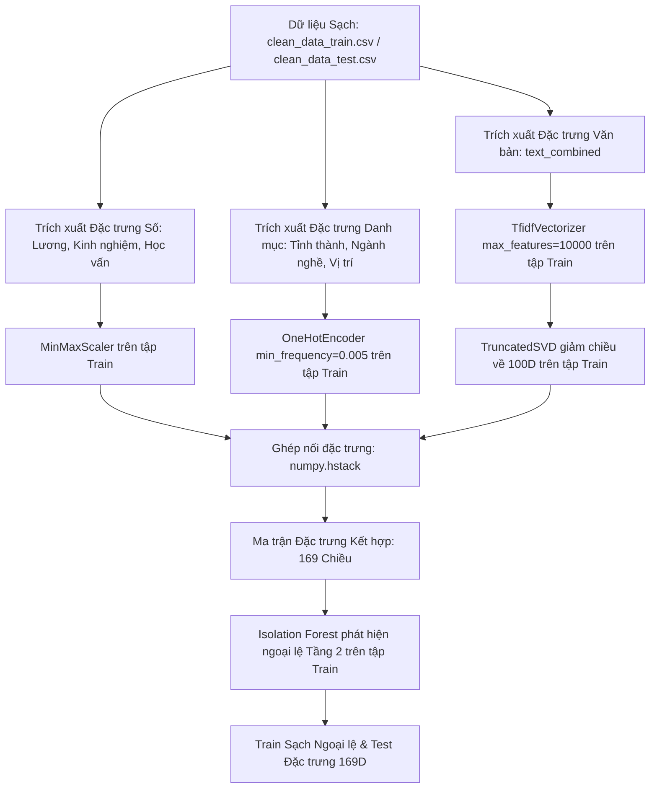

# Báo cáo Kết quả Giai đoạn 2: Trích xuất Đặc trưng và Lọc ngoại lệ Không gian Vector

Tài liệu này tổng hợp chi tiết quy trình, cơ sở toán học và kịch bản thực thi trong **Giai đoạn 2: Trích xuất Đặc trưng và Lọc ngoại lệ Không gian Vector** của dự án Phân cụm thị trường việc làm Việt Nam. Quy trình được thiết kế đồng bộ tương ứng với mã nguồn trong tệp tin `notebooks/02_feature_engineering.ipynb`.

---

## 1. Lưu đồ Quy trình Trích xuất Đặc trưng (Mermaid Flowchart)

Quy trình biến đổi từ dữ liệu sạch dạng bảng sang ma trận đặc trưng 169 chiều được thể hiện trong sơ đồ dưới đây:

---

## 2. Các Bước Thực hiện Chi tiết & Cơ sở Toán học

### Bước 1: Mã hóa Đặc trưng Cấu trúc Số
*   **Mã hóa Học vấn**: Thuộc tính bậc học vấn `education_level` được ánh xạ có thứ tự (Ordinal Encoding) sang khoảng số thực từ 0 đến 5:
    $$\text{Không yêu cầu} \rightarrow 0, \text{ Trung học} \rightarrow 1, \text{ Chứng chỉ} \rightarrow 2, \text{ Trung cấp/Bằng liên quan} \rightarrow 3, \text{ Cao đẳng} \rightarrow 4, \text{ Đại học/Cử nhân/Kỹ sư} \rightarrow 5$$
*   **Co giãn dữ liệu số (MinMaxScaler)**: Đưa 5 thuộc tính số liên tục (`salary_min_m_vnd`, `salary_max_m_vnd`, `exp_min_years`, `exp_max_years`, `edu_encoded`) về đoạn $[0, 1]$ để cân bằng khoảng cách hình học:
    $$x_{\text{scaled}} = \frac{x - \min(X_{\text{Train}})}{\max(X_{\text{Train}}) - \min(X_{\text{Train}})}$$
    *   *Lưu ý*: Chỉ thực hiện `.fit_transform()` trên tập Train và gọi `.transform()` trên tập Test để ngăn ngừa rò rỉ dữ liệu.

### Bước 2: Mã hóa Đặc trưng Danh mục (One-Hot Encoding)
*   **Bài toán**: Các biến danh mục (`location`, `job_type`, `job_industry`, `job_position`) khi mã hóa One-Hot trực tiếp sẽ tạo ra hàng ngàn cột thưa, gây bùng nổ số chiều.
*   **Giải pháp**: Áp dụng trình mã hóa `OneHotEncoder` của thư viện Scikit-learn với tham số `min_frequency=0.005`. Các danh mục có tần suất xuất hiện nhỏ hơn $0.5\%$ trên toàn tập huấn luyện sẽ tự động được gom vào nhóm chung dưới dạng biến ẩn. Thiết lập `handle_unknown='infrequent_if_exist'` trên tập Test để gom các giá trị phân loại mới phát sinh vào nhóm này.
*   **Kết quả**: Tạo ra **64 chiều đặc trưng nhị phân** tối ưu đại diện cho các nhóm lớn nhất của thị trường việc làm.

### Bước 3: Vector hóa Văn bản và Giảm chiều Ngữ nghĩa (TF-IDF + TruncatedSVD)
*   **Tạo ma trận TF-IDF**: Cột text kết hợp được vector hóa với cấu hình `ngram_range=(1,2)`, `min_df=5`, `max_df=0.85` và danh sách từ dừng tiếng Việt tùy chỉnh (loại bỏ các từ chung như *và, của, công ty, yêu cầu*). Số lượng đặc trưng tối đa giới hạn ở mức 10,000 từ khóa thưa.
    *   Tần suất từ khóa (TF) trong tài liệu $d$:
        $$\text{TF}(t, d) = \frac{f_{t,d}}{\sum_{t' \in d} f_{t',d}}$$
    *   Tần suất tài liệu ngược (IDF) trên tập tài liệu $D$:
        $$\text{IDF}(t, D) = \log \left(\frac{1 + |D|}{1 + |\{d \in D : t \in d\}|}\right) + 1$$
    *   Giá trị TF-IDF:
        $$\text{TF-IDF}(t, d, D) = \text{TF}(t, d) \times \text{IDF}(t, D)$$
*   **Giảm chiều bằng TruncatedSVD (LSA)**: Để tránh lời nguyền chiều kích trong đo khoảng cách Euclid, ma trận TF-IDF thưa 10,000 cột được nén về **100 chiều trực giao ngữ nghĩa** thông qua phân tích suy hao kỳ dị (Singular Value Decomposition):
    $$X_{\text{TF-IDF}} \approx U_k \Sigma_k V_k^T$$
    Với $k=100$. Bộ giảm chiều chỉ được fit trên tập Train, tập Test chỉ được chiếu lên không gian $V_k$ thông qua `.transform()`.

### Bước 4: Lọc Ngoại lệ Không gian Vector (Isolation Forest)
*   **Phương pháp**: Ghép nối 5 đặc trưng số đã scale, 64 cột nhị phân One-Hot và 100 trục SVD thành ma trận đặc trưng **169 chiều**. Áp dụng thuật toán rừng cô lập (Isolation Forest) trên tập Train với tỷ lệ `contamination=0.04` (lọc bỏ $4\%$ tin tuyển dụng có cấu trúc đặc dị hoặc mô tả từ ngữ kỳ dị).
*   **Cơ chế**: Thuật toán xây dựng các cây cô lập (iTrees). Điểm bất thường (anomaly score) của điểm dữ liệu $x$ được tính bằng:
    $$s(x, n) = 2^{-\frac{E(h(x))}{c(n)}}$$
    Trong đó $E(h(x))$ là chiều sâu trung bình của đường dẫn tìm kiếm điểm $x$ trên các cây iTrees, và $c(n)$ là chiều sâu trung bình của cây nhị phân tìm kiếm lỗi. Điểm có $s(x, n) \rightarrow 1$ (đường dẫn tìm kiếm rất ngắn) sẽ bị đánh nhãn là ngoại lệ và loại bỏ.
*   **Kết quả**: Loại bỏ **14,715 dòng ngoại lệ** khỏi tập Train, dữ liệu huấn luyện cuối cùng còn lại **523,972 dòng sạch** lưu vào `results/clean_data_train_final.csv`. Tập Test được giữ nguyên kích thước để kiểm tra khả năng bao phủ thực tế.

### Bước 5: Bác bỏ StandardScaler toàn cục
*   **Nguyên tắc hình học**: Không áp dụng `StandardScaler` lên ma trận đặc trưng hỗn hợp 169D. StandardScaler sẽ chia các cột nhị phân One-Hot cho độ lệch chuẩn rất bé của chúng, làm méo mó nghiêm trọng không gian Euclid và dẫn đến hiện tượng dồn cụm (clumping) trong K-Means. Việc giữ nguyên khoảng cách thô giúp bảo toàn ý nghĩa của các chiều One-Hot và cấu trúc phương sai của SVD.

---

## 3. Kích thước Ma trận Đặc trưng Đầu ra

Ma trận đặc trưng được lưu dưới dạng nén `.npz` trong thư mục `results/`:
*   `features_train.npz`:
    *   `features_160d` (ma trận đặc trưng phân cụm 169D): Kích thước `(523,972, 169)`
    *   `features_2d` (tọa độ trực quan hóa UMAP 2D): Kích thước `(523,972, 2)`
*   `features_test.npz`:
    *   `features_160d` (ma trận đặc trưng phân cụm 169D): Kích thước `(60,644, 169)`
    *   `features_2d` (tọa độ trực quan hóa UMAP 2D): Kích thước `(60,644, 2)`
*   Mô hình tiền xử lý đã huấn luyện được lưu trữ trong thư mục `models/` phục vụ quy trình suy diễn.
