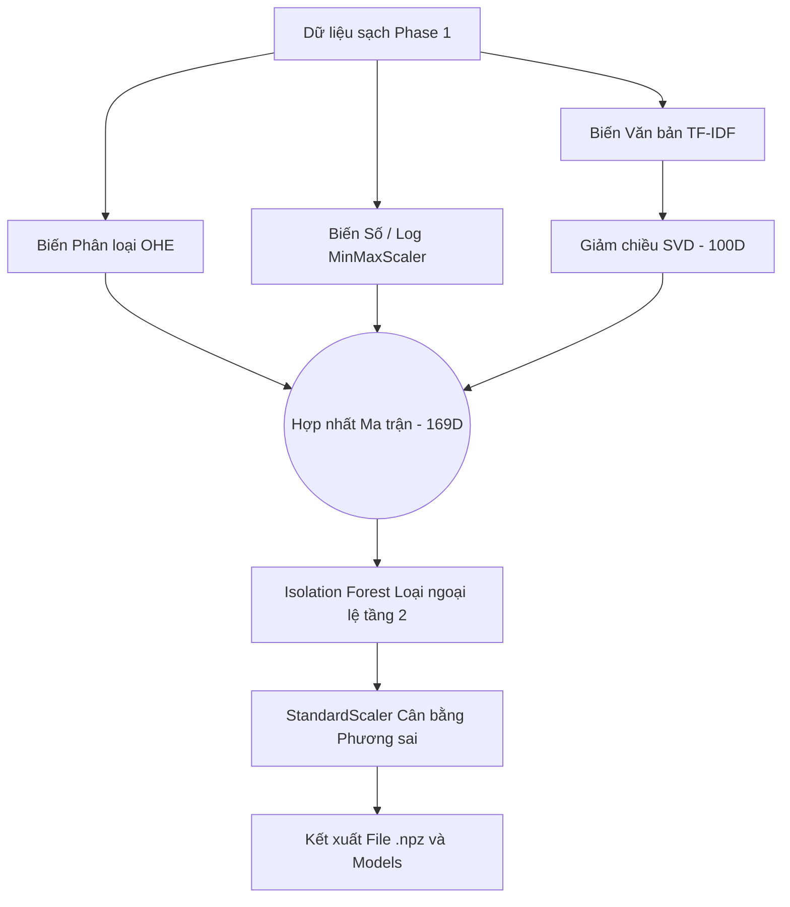

# BÁO CÁO GIAI ĐOẠN 2: TRÍCH XUẤT ĐẶC TRƯNG & GIẢM CHIỀU DỮ LIỆU
**(Feature Engineering & Dimensionality Reduction)**

Tài liệu này giải thích chuyên sâu về các quyết định thiết kế thuật toán, lý thuyết toán học và cơ chế đảm bảo chất lượng mô hình (chống rò rỉ dữ liệu) được thực thi trong file `notebooks/02_feature_engineering.ipynb`.

---

## 1. Kiểm tra Rò rỉ Dữ liệu (Data Leakage Check)
Trước khi đi sâu vào thuật toán, cần khẳng định pipeline từ Phase 1 sang Phase 2 **hoàn toàn KHÔNG CÓ RÒ RỈ DỮ LIỆU (Zero Data Leakage)**. Mọi tham số không gian vector đều tuân thủ nguyên tắc cách ly khắt khe:

> [!IMPORTANT]
> Toàn bộ các bộ chuyển đổi (Transformers) bao gồm `MinMaxScaler`, `OneHotEncoder`, `TfidfVectorizer`, `TruncatedSVD`, `IsolationForest` và `StandardScaler` đều sử dụng phương thức `fit()` **CHỈ ĐỘC QUYỀN TRÊN TẬP TRAIN**. Tập Test chỉ được gọi hàm `transform()` mô phỏng dữ liệu "unseen" trong môi trường Production thực tế.

---

## 2. Kiến trúc Biến đổi Dữ liệu 

---

## 3. Giải phẫu Các Thuật toán Cốt lõi

### 3.1. Xử lý Biến có Cấu trúc (Cell 6)

- **Ordinal Encoding (Học vấn):** Biến `education_level` chứa thông tin có thứ bậc (High School < Bachelor < Master). Phải map thủ công bằng Dictionary sang số để bảo toàn quan hệ độ lớn.
- **MinMaxScaler (Biến số & Log Transform):** 
  - Các biến liên tục (như `salary_min_log1p`, `exp_min_years`) được co giãn về dải tuyến tính $[0, 1]$.
  - **Toán học:** $X_{\text{norm}} = \frac{X - X_{\text{min}}}{X_{\text{max}} - X_{\text{min}}}$
- **One-Hot Encoding (Biến danh mục):** 
  - Áp dụng trên: `location, job_type, job_industry, job_position`.
  - **Tại sao lại set `min_frequency=0.005`?** Đây là kỹ thuật chặn Bùng nổ Chiều (Curse of Dimensionality). Những danh mục xuất hiện dưới 0.5% sẽ tự động bị gộp vào nhóm `"infrequent_sklearn"`. Điều này nén ma trận phân loại xuống chỉ còn đúng 64 chiều (rất tối ưu).

### 3.2. Xử lý Ngôn ngữ Tự nhiên - NLP (Cell 10)

- **TfidfVectorizer:** 
  - Trích xuất đặc trưng từ cột `text_combined` (tiêu đề + mô tả + yêu cầu).
  - Thuật toán phạt nặng các từ xuất hiện ở mọi tin tuyển dụng (như "làm việc", "công ty") bằng chỉ số IDF, và tôn vinh các từ khóa đặc trưng ("reactjs", "b2b sales").
  - Kích thước ma trận thô: Khổng lồ với $10,000$ chiều (`max_features=10000`).
- **TruncatedSVD (Latent Semantic Analysis - LSA):**
  - Giảm ma trận thưa thớt $10,000$ chiều xuống còn $100$ chiều dày đặc. SVD giải quyết hoàn hảo vấn đề từ đồng nghĩa (synonyms) bằng cách gom chúng vào chung một "Concept" không gian vector.

### 3.3. Khử Nhiễu Đa Chiều với Isolation Forest (Cell 13)

- Khác với lọc nhiễu "thủ công" ở Phase 1 (bằng IQR/Winsorize trên từng cột), ở Phase 2, mô hình đối diện với không gian khổng lồ 169 chiều.
- **Vì sao dùng Isolation Forest?** Đây là thuật toán xây dựng hàng loạt cây quyết định (Random Trees) để cô lập các điểm dữ liệu. Các điểm "dị thường" (Ngoại lệ) cần cực kỳ ít bước chẻ nhánh (splits) để bị cô lập. 
- Mức nhiễm bẩn (`contamination=0.04`) đã lọc thành công $4\%$ điểm nhiễu trong không gian Vector mà mắt người không thể nhìn thấy, giúp các tâm cụm (Centroids) của K-Means ở Giai đoạn sau trở nên siêu sắc nét.

### 3.4. Chuẩn hóa Cuối Cùng - StandardScaler (Cell 16)

> [!CAUTION]
> Đây là bản vá cực kỳ quan trọng được cập nhật vào kiến trúc. Nếu không chạy bước này, K-Means sẽ tính sai khoảng cách do bị thiên lệch vào các chiều có phương sai lớn.

- **Vì sao:** Trong ma trận hợp nhất 169 chiều, dữ liệu SVD dao động trong khoảng hẹp (vài phần mười), trong khi MinMax nằm ở $[0,1]$, OneHot chỉ có $0,1$.
- **Giải pháp:** `StandardScaler` ép toàn bộ 169 trục về chung phân phối chuẩn $N(0, 1)$ với Mean $\mu = 0$ và Variance $\sigma^2 = 1$. 
- Điều này buộc thuật toán tính khoảng cách Euclid (K-Means) phải coi trọng ngữ nghĩa văn bản ngang bằng với mức lương hoặc vị trí địa lý.

---

## 4. Kết Quả Lưu Trữ (Cell 18 & 20)

- **Dữ liệu đầu ra:** Ma trận nén dạng `Numpy Compressed` (`features_train.npz` & `features_test.npz`) với chiều dữ liệu cực đẹp: **169D**.
- **Mô hình Pipeline (Models):** `scaler_num.pkl`, `ohe.pkl`, `tfidf.pkl`, `svd.pkl`, `iso_forest.pkl`.
- Toàn bộ pipeline này đã có thể đem vào API Server để xử lý thời gian thực đối với bất kỳ tin đăng tuyển dụng mới nào!
