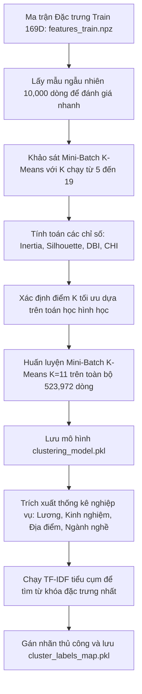

# Báo cáo Kết quả Giai đoạn 3: Phân cụm và Thiết lập Hồ sơ Cụm Ngữ nghĩa

Tài liệu này tổng hợp chi tiết quy trình, cơ sở toán học và kết quả thực nghiệm trong **Giai đoạn 3: Phân cụm và Thiết lập Hồ sơ Cụm Ngữ nghĩa** của dự án Phân cụm thị trường việc làm Việt Nam. Quy trình được thiết kế đồng bộ tương ứng với mã nguồn trong tệp tin `training.ipynb` (hoặc `notebooks/03_training.ipynb`).

---

## 1. Lưu đồ Quy trình Huấn luyện & Đánh giá (Mermaid Flowchart)

Quy trình tìm số cụm tối ưu, huấn luyện và thiết lập đặc trưng ngữ nghĩa cho các cụm được mô tả dưới đây:

---

## 2. Các Bước Thực hiện Chi tiết & Cơ sở Toán học

### Bước 1: Khảo sát Số cụm K bằng các Chỉ số Hình học
Mô hình `MiniBatchKMeans` được chạy khảo sát với số cụm $K \in [5, 7, 9, 11, 13, 15, 17, 19]$. Các chỉ số đánh giá chất lượng phân cụm bao gồm:

*   **Inertia (Tổng bình phương khoảng cách trong cụm)**: Đo độ cô đặc của các cụm. Mục tiêu là tìm điểm gãy (Elbow) nơi tốc độ giảm Inertia bắt đầu chững lại:
    $$\text{Inertia} = \sum_{i=1}^{N} \min_{\mu_j \in C} \|x_i - \mu_j\|^2$$
    Trong đó $x_i$ là điểm dữ liệu và $\mu_j$ là tâm của cụm $C_j$.
*   **Silhouette Score (Hệ số dáng điệu)**: Đo mức độ tương đồng của một điểm với cụm của nó so với các cụm lân cận. Được tính trên mẫu ngẫu nhiên 10,000 dòng đồng nhất để giảm tải bộ nhớ:
    $$s(i) = \frac{b(i) - a(i)}{\max(a(i), b(i))}$$
    Trong đó $a(i)$ là khoảng cách trung bình từ điểm $i$ đến các điểm khác trong cùng cụm, và $b(i)$ là khoảng cách trung bình nhỏ nhất từ điểm $i$ đến các điểm trong cụm khác. Giá trị Silhouette trung bình càng tiến gần $+1$ thể hiện cấu trúc cụm càng cô đặc và tách biệt rõ ràng.
*   **Davies-Bouldin Index (DBI)**: Đo tỷ lệ khoảng cách nội cụm so với khoảng cách liên cụm. Cụm phân tách tốt khi DBI nhỏ:
    $$\text{DBI} = \frac{1}{k} \sum_{i=1}^{k} \max_{j \neq i} \left( \frac{s_i + s_j}{d(\mu_i, \mu_j)} \right)$$
    Trong đó $s_i$ là khoảng cách trung bình từ các điểm cụm $i$ đến tâm cụm $\mu_i$, và $d(\mu_i, \mu_j)$ là khoảng cách Euclid giữa hai tâm cụm.
*   **Calinski-Harabasz Index (CHI)**: Tỷ số giữa phương sai liên cụm và phương sai nội cụm. Giá trị CHI lớn thể hiện sự phân tách cụm tốt:
    $$\text{CHI} = \frac{\text{Tr}(B_k)}{\text{Tr}(W_k)} \times \frac{N - k}{k - 1}$$
    Trong đó $B_k$ là ma trận phân tán giữa các cụm và $W_k$ là ma trận phân tán nội bộ cụm.

### Bước 2: Huấn luyện Mô hình Phân cụm Tối ưu ($K^* = 11$)
Kết quả khảo sát thực nghiệm trên tập Train chỉ ra $K=11$ là mốc tối ưu toán học:
*   *Inertia*: 903,277.16 (giảm mạnh từ 1,072,154.87 ở mốc $K=5$).
*   *Silhouette*: Đạt giá trị **cực đại cục bộ** ở mức **$+0.0954$**.
*   *Davies-Bouldin Index (DBI)*: Đạt giá trị **nhỏ nhất** ở mức **$2.5680$**.
*   *Calinski-Harabasz Index (CHI)*: Đạt mức cao **$531.2788$**.

Tiến hành huấn luyện mô hình `MiniBatchKMeans` với tham số `n_clusters=11`, `batch_size=2048`, `n_init=10` trên toàn bộ tập dữ liệu huấn luyện sạch gồm **523,972 dòng**.

### Bước 3: Trích xuất Đặc tính Cụm & Gán nhãn Ngữ nghĩa (Profiling)
Với mỗi cụm $c \in [0, 10]$, dự án tiến hành lọc các dòng dữ liệu thuộc cụm để tính toán:
1.  **Tỷ trọng**: Phần trăm số lượng tin tuyển dụng thuộc cụm trên tổng thể dữ liệu Train.
2.  **Thông số kinh tế**: Mức lương tối thiểu trung vị (Median) và số năm kinh nghiệm yêu cầu trung vị.
3.  **Tỉnh thành chính & Ngành nghề chính**: Tìm Yếu vị (Mode) của cột địa điểm và ngành nghề.
4.  **Từ khóa ngữ nghĩa chính**: Chạy bộ vector hóa `TfidfVectorizer` (lọc từ dừng chuyên dụng) trên mẫu ngẫu nhiên 15,000 mô tả công việc thuộc riêng tiểu cụm đó để trích xuất 5 từ khóa có điểm TF-IDF trung bình cao nhất.
5.  **Gán nhãn chuyên môn**: Từ các đặc trưng trên, gán tên nhãn chuẩn nghiệp vụ cho từng cụm và lưu thành tệp tin ánh xạ `models/cluster_labels_map.pkl`.

---

## 3. Chi tiết Hồ sơ 11 Cụm Tối ưu sau Huấn luyện

Dưới đây là kết quả phân tích hồ sơ (Profiling) chi tiết của 11 cụm tối ưu trên tập Train:

1.  **Cụm 00: Kế toán & Kiểm toán chuyên nghiệp (Accounting & Finance) - Miền Nam**
    *   *Tỷ lệ*: 4.79% | *Lương Med*: 9.0M | *Kinh nghiệm Med*: 3.0 năm | *Ngành*: Kế toán/Kiểm toán | *Vùng*: Hồ Chí Minh | *Từ khóa*: `toán`, `kế`, `kế toán`.
2.  **Cụm 01: Chuyên viên văn phòng & Hành chính tổng hợp (Office & Administration) - Miền Bắc**
    *   *Tỷ lệ*: 11.23% | *Lương Med*: 10.0M | *Kinh nghiệm Med*: 3.0 năm | *Ngành*: Kế toán/Kiểm toán | *Vùng*: Hà Nội | *Từ khóa*: `hàng`, `năng`, `khách`, `khách hàng`, `toán`.
3.  **Cụm 02: Quản lý kinh doanh & Trưởng nhóm (Business Management & Team Leads) - Miền Nam**
    *   *Tỷ lệ*: 9.87% | *Lương Med*: 10.0M | *Kinh nghiệm Med*: 3.0 năm | *Ngành*: Bán hàng/Kinh doanh | *Vùng*: Hồ Chí Minh | *Từ khóa*: `hàng`, `năng`, `khách`, `lý`, `kinh`.
4.  **Cụm 03: Bán hàng & Phát triển thị trường (Sales & Business Development) - Miền Nam**
    *   *Tỷ lệ*: 11.56% | *Lương Med*: 8.0M | *Kinh nghiệm Med*: 2.0 năm | *Ngành*: Bán hàng/Kinh doanh | *Vùng*: Hồ Chí Minh | *Từ khóa*: `hàng`, `khách`, `khách hàng`, `năng`, `kinh`.
5.  **Cụm 04: Dịch vụ khách hàng & Call Center (Customer Service & Call Center) - Miền Nam**
    *   *Tỷ lệ*: 13.57% | *Lương Med*: 8.0M | *Kinh nghiệm Med*: 2.0 năm | *Ngành*: Chăm sóc khách hàng | *Vùng*: Hồ Chí Minh | *Từ khóa*: `hàng`, `khách`, `khách hàng`, `năng`, `kinh`.
6.  **Cụm 05: Tài chính & Quản trị doanh nghiệp cấp cao (Senior Management & Finance) - Miền Bắc**
    *   *Tỷ lệ*: 8.45% | *Lương Med*: 10.0M | *Kinh nghiệm Med*: 3.0 năm | *Ngành*: Bán hàng/Kinh doanh | *Vùng*: Hà Nội | *Từ khóa*: `hàng`, `năng`, `kinh`, `lý`, `quản`.
7.  **Cụm 06: Hỗ trợ kinh doanh & Vận hành nội bộ (Business Support & Operations)**
    *   *Tỷ lệ*: 4.69% | *Lương Med*: 8.0M | *Kinh nghiệm Med*: 3.0 năm | *Ngành*: Bán hàng/Kinh doanh | *Vùng*: Bà Rịa - Vũng Tàu | *Từ khóa*: `hàng`, `năng`, `khách`, `kinh`, `khách hàng`.
8.  **Cụm 07: Kỹ thuật, Dự án & Hành chính Nhân sự (Engineering, Projects & HR-Admin) - Miền Nam**
    *   *Tỷ lệ*: 12.33% | *Lương Med*: 9.0M | *Kinh nghiệm Med*: 3.0 năm | *Ngành*: Xây dựng | *Vùng*: Hồ Chí Minh | *Từ khóa*: `hàng`, `năng`, `khách`, `khách hàng`, `kinh`.
9.  **Cụm 08: Hỗ trợ khách hàng & Dịch vụ trực tiếp (Customer Assistance & Retail Services) - Miền Bắc**
    *   *Tỷ lệ*: 10.12% | *Lương Med*: 8.0M | *Kinh nghiệm Med*: 2.0 năm | *Ngành*: Chăm sóc khách hàng | *Vùng*: Hà Nội | *Từ khóa*: `hàng`, `khách`, `khách hàng`, `năng`, `kinh`.
10. **Cụm 09: Kỹ thuật sản xuất, Vận hành & Đào tạo chuyên môn (Technical, Operations & Training) - Miền Nam**
    *   *Tỷ lệ*: 6.54% | *Lương Med*: 9.0M | *Kinh nghiệm Med*: 3.0 năm | *Ngành*: Sản xuất/Vận hành | *Vùng*: Bình Dương | *Từ khóa*: `hàng`, `năng`, `khách`, `sản`, `kinh`.
11. **Cụm 10: Lao động dịch vụ & Vận tải phổ thông (Service Labor & Logistics) - Miền Nam**
    *   *Tỷ lệ*: 5.84% | *Lương Med*: 8.0M | *Kinh nghiệm Med*: 2.0 năm | *Ngành*: Vận tải/Kho bãi | *Vùng*: Hồ Chí Minh | *Từ khóa*: `hàng`, `khách`, `khách hàng`, `năng`, `định`.
