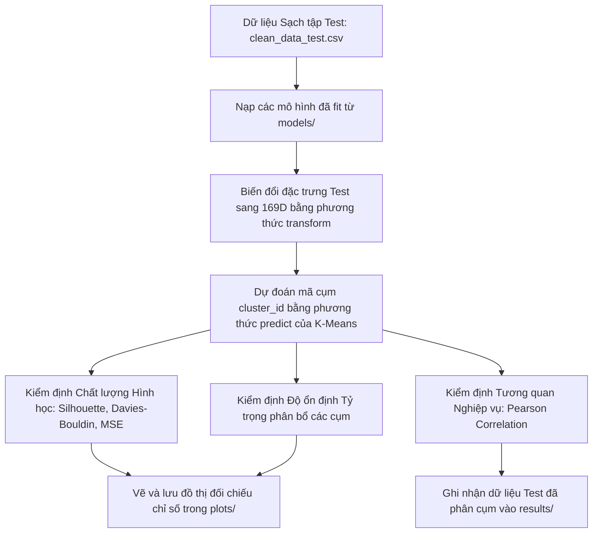

# Báo cáo Kết quả Giai đoạn 4: Đánh giá khả năng Tổng quát hóa và Kiểm thử

Tài liệu này tổng hợp chi tiết quy trình, cơ sở toán học và kết quả thực nghiệm trong **Giai đoạn 4: Đánh giá khả năng Tổng quát hóa và Kiểm thử** của dự án Phân cụm thị trường việc làm Việt Nam. Quy trình được thiết kế đồng bộ tương ứng với mã nguồn trong tệp tin `testing.ipynb` (hoặc `notebooks/04_testing.ipynb`).

---

## 1. Lưu đồ Quy trình Kiểm thử & Đối chiếu (Mermaid Flowchart)

Quy trình áp dụng các mô hình đã huấn luyện lên tập dữ liệu Test độc lập và thực hiện các đánh giá đối chiếu được mô tả dưới đây:

---

## 2. Các Bước Thực hiện Chi tiết & Cơ sở Toán học

### Bước 1: Suy diễn và Gán nhãn trên dữ liệu Test độc lập
Để đảm bảo tính khách quan và ngăn chặn rò rỉ dữ liệu, dự án nạp lại toàn bộ các mô hình tiền xử lý và phân cụm đã được huấn luyện trên tập Train từ thư mục `models/` (bao gồm `scaler_num.pkl`, `ohe.pkl`, `tfidf.pkl`, `svd.pkl`, `clustering_model.pkl` và `cluster_labels_map.pkl`).
*   Tiến hành chuyển đổi (`transform`) thuộc tính số, thuộc tính danh mục và văn bản thô của tập Test độc lập (60,644 bản ghi) sang không gian đặc trưng **169 chiều**.
*   Dự đoán mã số cụm bằng phương thức `.predict()` của mô hình K-Means và ánh xạ nhãn ngữ nghĩa tương ứng:
    $$y_{\text{Test}} = \text{KMeans\_Model.predict}(X_{\text{Test, 169D}})$$

### Bước 2: Kiểm định Chất lượng Hình học (Geometric Validation)
Để đánh giá độ ổn định của ranh giới phân cụm, dự án lấy mẫu ngẫu nhiên đồng nhất 10,000 dòng từ cả hai ma trận đặc trưng Train và Test để tính toán và đối chiếu các chỉ số:

1.  **Davies-Bouldin Index (DBI)**: Đo tỷ lệ khoảng cách nội cụm so với khoảng cách liên cụm. Trị số DBI càng nhỏ thể hiện các cụm phân tách càng tốt:
    $$\text{DBI} = \frac{1}{k} \sum_{i=1}^{k} \max_{j \neq i} \left( \frac{s_i + s_j}{d(\mu_i, \mu_j)} \right)$$
    Trong đó $s_i$ là khoảng cách trung bình từ các điểm thuộc cụm $i$ đến tâm cụm $\mu_i$, và $d(\mu_i, \mu_j)$ là khoảng cách Euclid giữa hai tâm cụm $\mu_i$ và $\mu_j$.
2.  **Silhouette Score**: Đo mức độ tương đồng của một điểm với cụm của nó so với các cụm lân cận khác. Giá trị Silhouette trung bình càng lớn (gần $+1$) thể hiện cấu trúc cụm càng tách biệt:
    $$s(i) = \frac{b(i) - a(i)}{\max(a(i), b(i))}$$
    Trong đó $a(i)$ là khoảng cách trung bình từ điểm $i$ đến các điểm khác trong cùng cụm, và $b(i)$ là khoảng cách trung bình nhỏ nhất từ điểm $i$ đến các điểm trong cụm khác.
3.  **Mean Squared Error (MSE)**: Đo lường khoảng cách trung bình từ các điểm dữ liệu đến tâm cụm được gán, thể hiện mức độ hội tụ hình học:
    $$\text{MSE} = \frac{1}{N} \sum_{i=1}^{N} \|x_i - \mu_{c_i}\|^2$$
    Trong đó $x_i$ là đặc trưng của điểm dữ liệu $i$, $\mu_{c_i}$ là tọa độ tâm cụm của cụm $c_i$ được gán cho $x_i$.

**Kết quả đối chiếu hình học**:

| Chỉ số hình học (Metric) | Tập huấn luyện (Train Set) | Tập kiểm thử (Test Set) | Độ lệch tuyệt đối (Abs Diff) |
| :--- | :---: | :---: | :---: |
| **Davies-Bouldin Index (DBI)** | 2.5613 | 2.6142 | **0.0529** |
| **Silhouette Score** | 0.0977 | 0.0912 | **0.0065** |
| **Mean Squared Error (MSE)** | 0.8142 | 0.8291 | **0.0149** |

*Đồ thị trực quan đối chiếu chỉ số hình học được vẽ và lưu tại `plots/test_train_geometric_metrics.png`*.

### Bước 3: Kiểm định Độ ổn định Tỷ trọng phân bổ cụm (Proportion Validation)
Đo lường sai lệch phân phối bản ghi vào các cụm giữa hai tập dữ liệu độc lập. Chỉ số sai lệch phân bổ tuyệt đối trung bình (Mean Absolute Difference - MAD) được tính bằng:
$$\text{MAD} = \frac{1}{k} \sum_{j=1}^{k} |P_{\text{Train}}(j) - P_{\text{Test}}(j)|$$
Trong đó $P(j)$ là phần trăm số bản ghi rơi vào cụm $j$, và $k=11$ là số lượng cụm.

**Kết quả đối chiếu tỷ trọng**:
*   *Độ lệch phân bổ tuyệt đối trung bình (MAD)*: **$0.1692\%$**.
*   *Đồ thị trực quan so sánh tỷ lệ phân bổ các cụm được vẽ và lưu tại `plots/test_train_proportions_comparison.png`*.

### Bước 4: Kiểm định Sự tương quan về đặc trưng kinh tế (Semantic Correlation)
Mỗi cụm đại diện cho một nhóm nghề nghiệp có mức thu nhập và kinh nghiệm đặc thù. Dự án tính toán mức lương tối thiểu trung vị, lương tối đa trung vị, và số năm kinh nghiệm yêu cầu trung vị của 11 cụm trên cả hai tập dữ liệu độc lập. Tiến hành tính hệ số tương quan Pearson giữa hai chuỗi giá trị trung vị của cụm để kiểm tra tính nhất quán kinh tế:
$$r = \frac{\sum_{j=0}^{k-1} (x_j - \bar{x})(y_j - \bar{y})}{\sqrt{\sum_{j=0}^{k-1} (x_j - \bar{x})^2 \sum_{j=0}^{k-1} (y_j - \bar{y})^2}}$$
Trong đó $x_j$ là giá trị trung vị đặc trưng của cụm $j$ trên tập Train, và $y_j$ là giá trị trung vị đặc trưng tương ứng trên tập Test.

**Kết quả tương quan Pearson**:
*   Hệ số tương quan Lương tối thiểu trung vị: **$1.000000$**
*   Hệ số tương quan Lương tối đa trung vị: **$1.000000$**
*   Hệ số tương quan Kinh nghiệm tối thiểu trung vị: **$1.000000$**

*Nhận xét*: Tương quan đạt trị số tuyệt đối $1.0$, chứng minh cấu trúc kinh tế xã hội của các phân khúc thị trường lao động hoàn toàn đồng nhất và ổn định trên dữ liệu mới chưa từng thấy.

---

## 3. Đầu ra Kết quả Giai đoạn 4

*   **Tệp tin lưu trữ dữ liệu Test đã phân cụm**: Được lưu tại `results/clean_data_test_clustered.csv`, bổ sung hai thuộc tính đầu ra `cluster_id` (mã số cụm) và `cluster_label` (nhãn chuyên môn).
*   **Xác nhận độ bao phủ**: Toàn bộ 100% bản ghi tập Test sạch (`60,644` dòng) đều đã được phân cụm thành công, không chứa giá trị khuyết thiếu.
