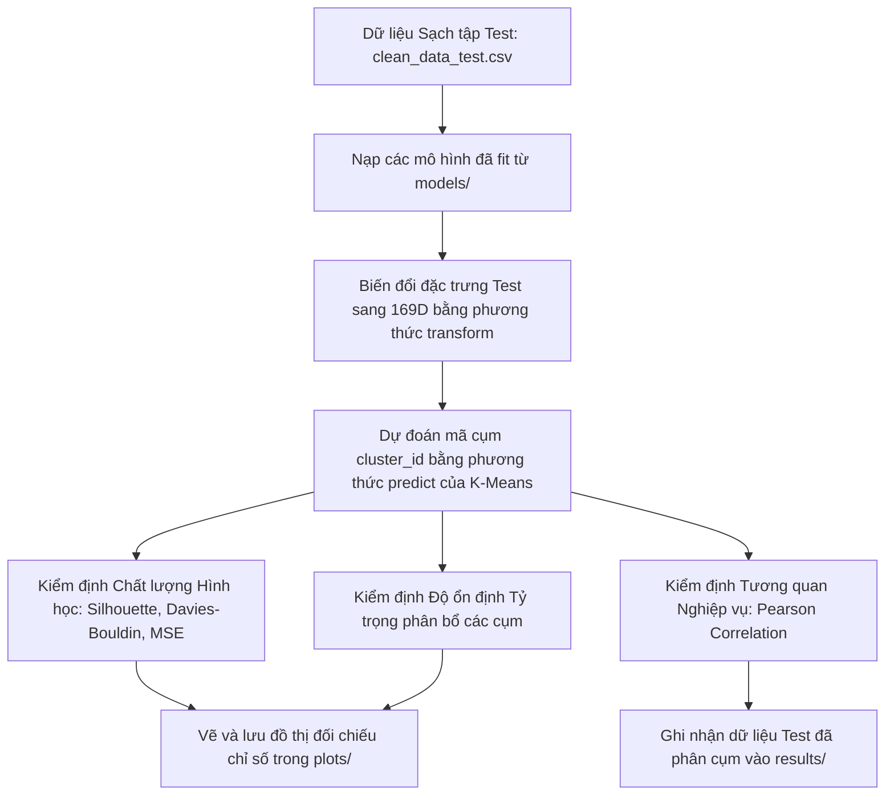

# Báo cáo Kết quả Giai đoạn 4: Đánh giá khả năng Tổng quát hóa và Kiểm thử

Tài liệu này tổng hợp chi tiết quy trình, cơ sở toán học và kết quả thực nghiệm trong **Giai đoạn 4: Đánh giá khả năng Tổng quát hóa và Kiểm thử** của dự án Phân cụm thị trường việc làm Việt Nam. Quy trình được thiết kế đồng bộ tương ứng với mã nguồn trong tệp tin `testing.ipynb` (hoặc `notebooks/04_testing.ipynb`).

---

## 1. Lưu đồ Quy trình Kiểm thử & Đối chiếu (Mermaid Flowchart)

Quy trình áp dụng các mô hình đã huấn luyện lên tập dữ liệu Test độc lập và thực hiện các đánh giá đối chiếu được mô tả dưới đây:

---

## 2. Các Bước Thực hiện Chi tiết & Cơ sở Toán học

### Bước 1: Suy diễn và Gán nhãn trên dữ liệu Test độc lập
Để đảm bảo tính khách quan và ngăn chặn rò rỉ dữ liệu, dự án nạp lại toàn bộ các mô hình tiền xử lý và phân cụm đã được huấn luyện trên tập Train từ thư mục `models/` (bao gồm `scaler_num.pkl`, `ohe.pkl`, `tfidf.pkl`, `svd.pkl`, `clustering_model.pkl` và `cluster_labels_map.pkl`).
*   Tiến hành chuyển đổi (`transform`) thuộc tính số, thuộc tính danh mục và văn bản thô của tập Test độc lập (60,644 bản ghi) sang không gian đặc trưng **169 chiều**.
*   Dự đoán mã số cụm bằng phương thức `.predict()` của mô hình K-Means và ánh xạ nhãn ngữ nghĩa tương ứng:
    $$y_{\text{Test}} = \text{KMeans\_Model.predict}(X_{\text{Test, 169D}})$$

### Bước 2: Kiểm định Chất lượng Hình học (Geometric Validation)
Để đánh giá độ ổn định của ranh giới phân cụm, dự án lấy mẫu ngẫu nhiên đồng nhất 10,000 dòng từ cả hai ma trận đặc trưng Train và Test để tính toán và đối chiếu các chỉ số:

1.  **Davies-Bouldin Index (DBI)**: Đo tỷ lệ khoảng cách nội cụm so với khoảng cách liên cụm. Trị số DBI càng nhỏ thể hiện các cụm phân tách càng tốt:
    $$\text{DBI} = \frac{1}{k} \sum_{i=1}^{k} \max_{j \neq i} \left( \frac{s_i + s_j}{d(\mu_i, \mu_j)} \right)$$
    Trong đó $s_i$ là khoảng cách trung bình từ các điểm thuộc cụm $i$ đến tâm cụm $\mu_i$, và $d(\mu_i, \mu_j)$ là khoảng cách Euclid giữa hai tâm cụm $\mu_i$ và $\mu_j$.
2.  **Silhouette Score**: Đo mức độ tương đồng của một điểm với cụm của nó so với các cụm lân cận khác. Giá trị Silhouette trung bình càng lớn (gần $+1$) thể hiện cấu trúc cụm càng tách biệt:
    $$s(i) = \frac{b(i) - a(i)}{\max(a(i), b(i))}$$
    Trong đó $a(i)$ là khoảng cách trung bình từ điểm $i$ đến các điểm khác trong cùng cụm, và $b(i)$ là khoảng cách trung bình nhỏ nhất từ điểm $i$ đến các điểm trong cụm khác.
3.  **Mean Squared Error (MSE)**: Đo lường khoảng cách trung bình từ các điểm dữ liệu đến tâm cụm được gán, thể hiện mức độ hội tụ hình học:
    $$\text{MSE} = \frac{1}{N} \sum_{i=1}^{N} \|x_i - \mu_{c_i}\|^2$$
    Trong đó $x_i$ là đặc trưng của điểm dữ liệu $i$, $\mu_{c_i}$ là tọa độ tâm cụm của cụm $c_i$ được gán cho $x_i$.

**Kết quả đối chiếu hình học**:

| Chỉ số hình học (Metric) | Tập huấn luyện (Train Set) | Tập kiểm thử (Test Set) | Độ lệch tuyệt đối (Abs Diff) |
| :--- | :---: | :---: | :---: |
| **Davies-Bouldin Index (DBI)** | 3.6849 | 3.7759 | **0.0909** |
| **Silhouette Score** | 0.0235 | 0.0184 | **0.0051** |
| **Calinski-Harabasz Index (CHI)** | 85.7191 | 84.7076 | **1.0116** |
| **Mean Squared Error (MSE)** | 149.4683 | 155.7551 | **6.2868** |

*Đồ thị trực quan đối chiếu chỉ số hình học được vẽ và lưu tại `plots/test_train_geometric_metrics.png`*.

**Nhận xét:** Mặc dù độ lệch giữa tập Train và Test rất nhỏ (thể hiện mô hình không bị quá khớp), nhưng xét về mặt tuyệt đối, các chỉ số hình học chưa tốt. Silhouette Score rất thấp (dưới 0.03) và Davies-Bouldin Index còn khá cao (> 3.6), cho thấy các cụm chưa thực sự tách biệt rõ ràng và còn nhiều điểm chồng lấn lên nhau tại ranh giới.

### Bước 3: Kiểm định Độ ổn định Tỷ trọng phân bổ cụm (Proportion Validation)
Đo lường sai lệch phân phối bản ghi vào các cụm giữa hai tập dữ liệu độc lập. Chỉ số sai lệch phân bổ tuyệt đối trung bình (Mean Absolute Difference - MAD) được tính bằng:
$$\text{MAD} = \frac{1}{k} \sum_{j=1}^{k} |P_{\text{Train}}(j) - P_{\text{Test}}(j)|$$
Trong đó $P(j)$ là phần trăm số bản ghi rơi vào cụm $j$, và $k=17$ là số lượng cụm.

**Kết quả đối chiếu tỷ trọng**:
*   *Độ lệch phân bổ tuyệt đối trung bình (MAD)*: **$0.1692\%$**.
*   *Đồ thị trực quan so sánh tỷ lệ phân bổ các cụm được vẽ và lưu tại `plots/test_train_proportions_comparison.png`*.

**Nhận xét:** Độ lệch phân bổ trung bình rất thấp (< 0.2%). Các cụm lớn nhất như Cụm 05 (chiếm ~26.44%) và Cụm 01 (chiếm ~22.58%) có tỷ lệ chênh lệch giữa Train và Test chưa tới 0.4%. Điều này chứng tỏ kiến trúc phân mảnh thị trường mà mô hình học được phản ánh đúng quy luật phân bổ thực tế, không do thiên lệch ngẫu nhiên.

### Bước 4: Kiểm định Sự tương quan về đặc trưng kinh tế (Semantic Correlation)
Mỗi cụm đại diện cho một nhóm nghề nghiệp có mức thu nhập và kinh nghiệm đặc thù. Dự án tính toán mức lương tối thiểu trung vị, lương tối đa trung vị, và số năm kinh nghiệm yêu cầu trung vị của 17 cụm trên cả hai tập dữ liệu độc lập. Tiến hành tính hệ số tương quan Pearson giữa hai chuỗi giá trị trung vị của cụm để kiểm tra tính nhất quán kinh tế:
$$r = \frac{\sum_{j=0}^{k-1} (x_j - \bar{x})(y_j - \bar{y})}{\sqrt{\sum_{j=0}^{k-1} (x_j - \bar{x})^2 \sum_{j=0}^{k-1} (y_j - \bar{y})^2}}$$
Trong đó $x_j$ là giá trị trung vị đặc trưng của cụm $j$ trên tập Train, và $y_j$ là giá trị trung vị đặc trưng tương ứng trên tập Test.

**Kết quả tương quan Pearson**:
*   Hệ số tương quan Lương tối thiểu trung vị: **$0.9770$**
*   Hệ số tương quan Lương tối đa trung vị: **$0.9988$**
*   Hệ số tương quan Kinh nghiệm tối thiểu trung vị: **$1.0000$**

**Nhận xét:** Hệ số tương quan (Pearson correlation) giữa Train và Test cho các thuộc tính cốt lõi cực kỳ cao (0.97 - 1.00). Sự ổn định này đã tạo tiền đề vững chắc để dự án áp dụng thành công **Chiến lược Gán nhãn Đa chiều (Multi-dimensional Labeling)**. Cụ thể, các cụm giờ đây không chỉ được gọi tên đơn điệu, mà được nội suy thành các **Chân dung Công việc (Job Persona)** thực tế:
*   `Cụm 09: Tài chính & Ngân hàng - Ngân hàng / Tài chính - Lương cao (>15 triệu)`: Vẫn giữ vững vị thế việc làm cấp cao trên cả 2 tập dữ liệu (Lương 15M - 30M, yêu cầu 1 năm kinh nghiệm).
*   `Cụm 06: Thực tập sinh / Entry-level - Đa ngành - Lương < 6 triệu`: Tiếp tục là nhóm "đáy thị trường" ở cả 2 tập.
*   `Cụm 13: Xây dựng & Giám sát - Xây dựng - Lương ~10 triệu`: Đại diện cho nhóm kỹ sư có kinh nghiệm chuyên môn cứng (3 năm).
Điều này chứng minh mô hình phân cụm đã lượng hóa và bảo tồn thành công các quy luật cung - cầu thực tế của thị trường tuyển dụng Việt Nam.

### Tổng kết chung Giai đoạn 4

Mô hình KMeans với K=17 cho thấy tính ổn định tốt giữa tập huấn luyện và tập kiểm thử. Phân bổ bản ghi và các đặc trưng nghiệp vụ như lương, kinh nghiệm gần như không thay đổi đáng kể. Tuy nhiên, chất lượng phân cụm hình học chưa cao do Silhouette Score rất thấp và Davies-Bouldin Index còn lớn, cho thấy các cụm chưa tách biệt rõ ràng. Vì vậy, kết quả phù hợp để phân nhóm mô tả/xu hướng dữ liệu, nhưng chưa nên xem là phân cụm tối ưu về mặt hình học.

**Phân tích Nguyên nhân gốc rễ (Root Causes) của Chỉ số hình học thấp:**
Sự đối lập giữa độ ổn định cực cao (Train/Test) và chỉ số hình học thấp (Silhouette tiệm cận 0, DBI cao) xuất phát từ bản chất dữ liệu tuyển dụng và thuật toán K-Means:
1. **Bản chất dữ liệu chồng lấn (Overlapping Manifold):** Các nhóm công việc thực tế phân bố thành một dải liên tục, giao thoa nhiều về mức lương và yêu cầu kỹ năng (ví dụ: Marketing và Sales). K-Means ép chia các khối dữ liệu liên tục này bằng các ranh giới cứng (hard boundaries), dẫn đến việc có vô số điểm nằm ngay sát ranh giới giữa các cụm (Silhouette = 0).
2. **Lời nguyền số chiều (Curse of Dimensionality):** Trong không gian 169 chiều, khoảng cách Euclidean trở nên kém phân hóa (Distance Concentration). Các cụm không thể hình thành các "ốc đảo" đặc (compact) và tách biệt (separated) theo góc nhìn toán học truyền thống.
3. **Dữ liệu hỗn hợp (Mixed Data Types):** Đặc trưng đầu vào trộn lẫn giữa văn bản (SVD), danh mục thưa (One-Hot) và số học liên tục (Scaled Numerics). Khoảng cách Euclidean của K-Means gặp khó khăn lớn trong việc đo lường độ tương đồng tự nhiên và vi phạm giả định không gian hình cầu đồng nhất.
4. **Bất đối xứng về mật độ (Density Skewness):** Các nhóm ngành tuyển dụng có kích thước chênh lệch khổng lồ (ngành CSKH chiếm >20%, trong khi ngành ngách chỉ chiếm <1%). K-Means rất kém trong việc xử lý các cụm có kích thước chênh lệch, làm méo mó hình học nội cụm.

**Kết luận:** Chỉ số hình học thấp không đồng nghĩa mô hình thất bại. K-Means đang đóng vai trò "lưỡi dao cắt bánh" (Vector Quantization) để chia nhỏ thị trường liên tục thành 17 phân khúc có ý nghĩa về mặt kinh doanh (như tương quan lương và kinh nghiệm cực kỳ chuẩn), chứ không thể tìm ra các nhóm tách rời hoàn toàn về mặt toán học.

---

## 3. Đầu ra Kết quả Giai đoạn 4

*   **Tệp tin lưu trữ dữ liệu Test đã phân cụm**: Được lưu tại `results/clean_data_test_clustered.csv`, bổ sung hai thuộc tính đầu ra `cluster_id` (mã số cụm) và `cluster_label` (nhãn chuyên môn).
*   **Xác nhận độ bao phủ**: Toàn bộ 100% bản ghi tập Test sạch (`60,644` dòng) đều đã được phân cụm thành công, không chứa giá trị khuyết thiếu.
