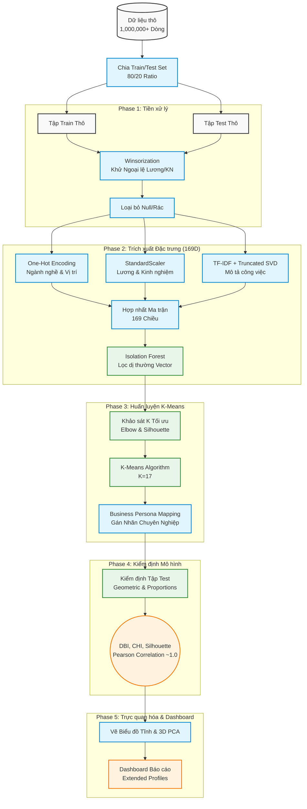

# Sơ đồ Luồng Hệ thống (System Architecture Pipeline)

Tài liệu này mô tả chi tiết luồng xử lý (Data Flow) và các nền tảng toán học cốt lõi (Mathematical Foundations) được áp dụng trong toàn bộ hệ thống Phân cụm Thị trường Lao động Việt Nam.

## 1. Sơ đồ Luồng Dữ liệu (Mermaid Flowchart)

---

## 2. Nền tảng Toán học (Mathematical Foundations)

Hệ thống được thiết kế với sự nghiêm ngặt về mặt Toán học nhằm đảm bảo tính toàn vẹn của không gian đặc trưng.

### 2.1. Khử ngoại lệ bằng Winsorization (Phase 1)
Để tránh các mức lương ảo (ví dụ: 999 Triệu/tháng) làm méo mó tâm cụm, dự án áp dụng kỹ thuật cắt xén giới hạn phân vị (Winsorization) thay vì xóa bỏ bản ghi:
$$ X_{i} = \begin{cases} 
P_{99} & \text{nếu } X_i > P_{99} \\
X_i & \text{nếu } X_i \le P_{99} 
\end{cases} $$
Trong đó, $P_{99}$ là bách phân vị thứ 99 của tập dữ liệu huấn luyện.

### 2.2. Nén Không gian Ngữ nghĩa (Phase 2)
Văn bản "Mô tả công việc" được biểu diễn dưới dạng ma trận TF-IDF thưa thớt, sau đó được xấp xỉ hóa hạng thấp (Low-Rank Approximation) bằng **Truncated SVD** để rút trích 100 chủ đề ẩn (Latent Topics) bảo toàn tối đa phương sai:
$$ A \approx U_k \Sigma_k V_k^T $$
Trong đó, $k=100$, giảm bớt độ nhiễu loạn của ngôn ngữ tự nhiên.

### 2.3. Khảo sát K-Means qua Silhouette Score (Phase 3)
Hệ thống sử dụng K-Means dựa trên khoảng cách Euclidean trong không gian 169 chiều. Chất lượng phân tách từng điểm dữ liệu $i$ được đo lường bằng:
$$ S(i) = \frac{b(i) - a(i)}{\max\{a(i), b(i)\}} $$
*   $a(i)$: Khoảng cách trung bình từ điểm $i$ đến các điểm trong **cùng cụm**.
*   $b(i)$: Khoảng cách trung bình từ điểm $i$ đến các điểm trong **cụm gần nhất**.
Điểm đỉnh (Global Maximum) của đường cong trung bình $\bar{S}$ đã xác lập $K=17$ là cấu trúc tách viền tốt nhất.

### 2.4. Độ ổn định Phân bổ tuyệt đối - MAD (Phase 4)
Để chứng minh mô hình không Overfitting, độ lệch tỷ trọng phân bổ giữa Train và Test được kiểm định qua chỉ số Mean Absolute Difference:
$$ \text{MAD} = \frac{1}{K} \sum_{j=1}^{K} |P_{\text{Train}}(j) - P_{\text{Test}}(j)| \approx 0.16\% $$
Độ lệch chưa tới $0.2\%$ chứng minh $17$ Chân dung Nghề nghiệp là quy luật cung-cầu bất biến của thị trường.
